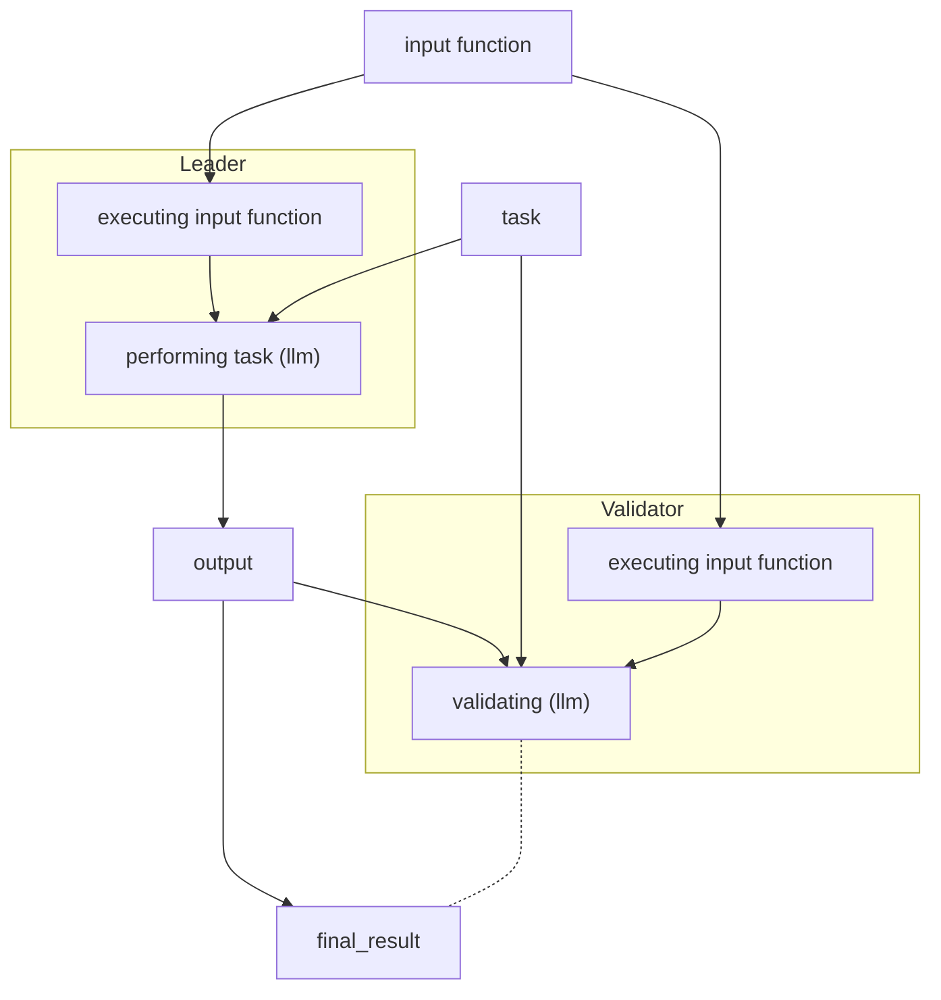

# Non comparative equivalence principle

## Out of scope of this document
Exact prompt values

## Generic definition

1. What leader does?<br>
    Executes regular stuff
2. What validator does?<br>
    It verifies that leaders output for some _input_ is valid

## Clarifying questions
- why do we need _input_?<br>
    imagine llm seeing this:<br>
    > Check that text summary is correct: rats are great pets

- what is _input_?<br>
    => a string, as in the end it must be a string so that it is dumped into a prompt (see [prompts and strings](./prompts_and_strings.md))
- what task can be performed on input? <br>
    in general it can be any function, but validator will need to have llm-friendly description of it

## @kp2pml30 proposal

### Schema



### Example
```python
    @gl.public.write
    def transfer(self, amount: int, to_address: str) -> None:
        input = f"""
You keep track of transactions between users and their balance in coins.
The current balance for all users in JSON format is:
{json.dumps(self.get_balances())}
The transaction to compute is: {{
sender: "{gl.message.sender_account.as_hex}",
recipient: "{Address(to_address).as_hex}",
amount: {amount},
}}
"""

        task = """For every transaction, validate that the user sending the Coins has
enough balance. If any transaction is invalid, it shouldn't be processed.
Update the balances based on the valid transactions only.
Given the current balance in JSON format and the transaction provided,
please provide the result of your calculation with the following format:
{{
"transaction_success": bool,          // Whether the transaction was successful
"transaction_error": str,             // Empty if transaction is successful
"updated_balances": object<str, int>  // Updated balances after the transaction
}}

It is mandatory that you respond only using the JSON format above,
nothing else. Don't include any other words or characters,
your output must be only JSON without any formatting prefix or suffix.
This result should be perfectly parsable by a JSON parser without errors.
"""

        final_result = gl.eq_principle_prompt_non_comparative(
            lambda: input,
            task,
        )
```

## @MuncleUscles proposal

```python
    @gl.public.write
    def transfer(self, amount: int, to_address: str) -> None:
        task_prompt = f"""
You are a smart computer program in charge of keeping track of user's balances for a currency.
Your task is to update the balances of the users based on the transaction provided.
If a user doesn't have enough balance, the transaction is invalid.
If the transaction is invalid, you should not update the balances.

<balances>
{json.dumps(self.get_balances())}
</balances>

<transaction>
{{
sender: "{gl.message.sender_account.as_hex}",
recipient: "{Address(to_address).as_hex}",
amount: {amount},
}}
</transaction>

Please provide the result of your calculation with the following format:
{{
"transaction_success": bool,          // Whether the transaction was successful
"transaction_error": str,             // Empty if transaction is successful
"updated_balances": object<str, int>  // Updated balances after the transaction
}}


It is mandatory that you respond only using the JSON format above,
nothing else. Don't include any other words or characters,
your output must be only JSON without any formatting prefix or suffix.
This result should be perfectly parsable by a JSON parser without errors."""
        print(task_prompt)

        def compute_updated_balances():
            result = gl.exec_prompt(task_prompt)
            return result

        final_result = gl.eq_principle_prompt_noncomparative(
            compute_updated_balances,
            leader_task = task_prompt,
            evaluation_criteria = """
The balance of the sender should have decreased by the amount sent.
The balance of the receiver should have increased by the amount sent.
The total sum of all balances should remain the same before and after the transaction""",
        )
```

## Differences
[@MuncleUscles](#muncleuscles) approach:
- does not allow to get data from the web, _input_ is embedded into the `task_prompt`
- `def compute_updated_balances():` captures `task_prompt` which can be bug prone
- > The balance of the sender should have decreased by the amount sent.

    is not present in the `task_prompt` ?!
